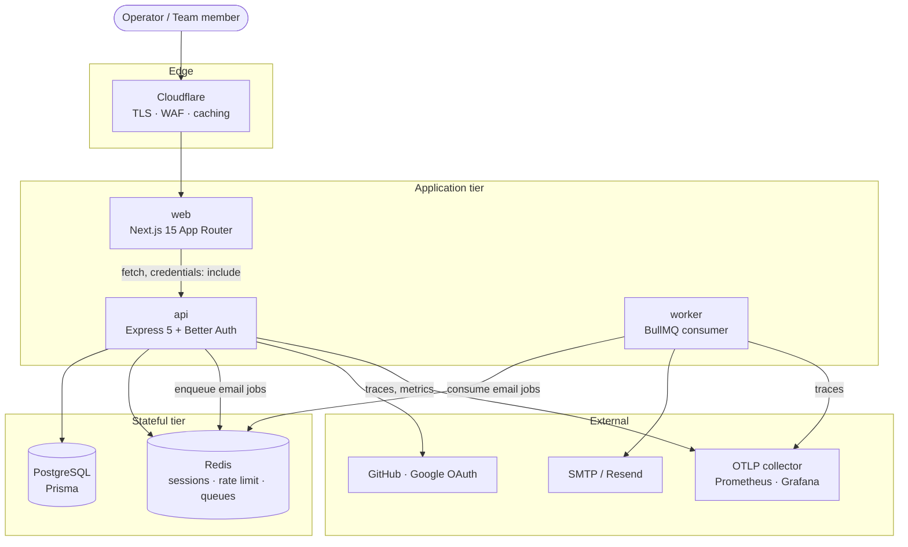
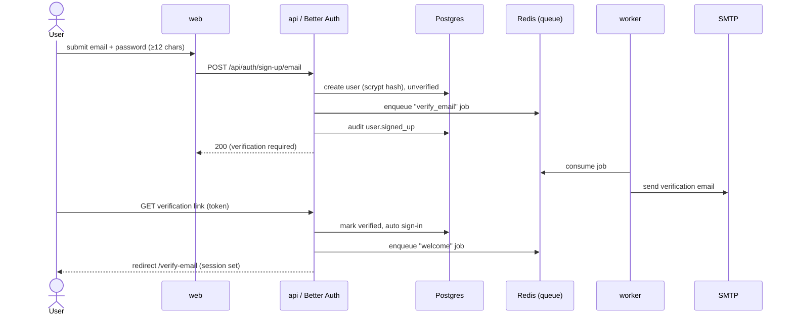
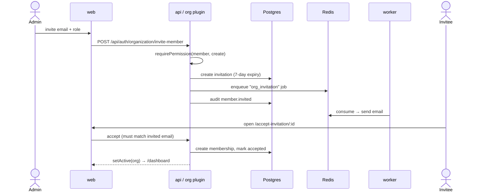

# Backend Uptime — Architecture (Phase 1)

This document describes the system as delivered in **Phase 1: Authentication &
Organizations**. It establishes the patterns every later phase builds on:
the monorepo layout, the auth/session model, the RBAC engine, the queue-first
side-effect pattern, and the observability surface.

> Phase scope: accounts, email verification, password reset, social login,
> TOTP two-factor, organizations, roles, invitations, audit logging, and the
> dashboard shell. Monitors, incidents, alerting, status pages, billing, and
> the developer platform are forward-declared (in the RBAC matrix and the UI)
> but not yet implemented.

---

## 1. System context



The **web** app never talks to Postgres or Redis directly. All reads and
mutations flow through the **api** service: Better Auth endpoints under
`/api/auth/*` for auth and organization mutations, and a thin custom REST
surface under `/v1` for read-heavy views (member directory, invitations,
audit log, org overview).

---

## 2. Monorepo layout

```
backend-uptime/
├── apps/
│   ├── api/        Express 5 HTTP API + Better Auth handler
│   ├── worker/     BullMQ consumer (email delivery in Phase 1)
│   └── web/        Next.js 15 dashboard + auth flows
├── packages/
│   ├── config/     Shared tsconfig presets (base / node / nextjs)
│   ├── shared/     RBAC matrix, error envelope, pagination, zod schemas
│   ├── db/         Prisma schema, client factory, migrations, seed
│   ├── auth/       Better Auth wiring (createAuth) + access-control bridge
│   └── notifications/  Email templates, sender, queue + processor
├── infra/          Prometheus + Grafana provisioning
├── docs/           This file + openapi, security, deployment
└── docker-compose.yml
```

Turborepo orchestrates `build` / `lint` / `typecheck` / `test`. `build`
depends on `^build` so workspace packages compile before the apps that import
them; packages emit `dist/` via `tsc`, and the apps consume the built output.

The whole repo is ESM (`"type": "module"`) on Node 22. tsconfig uses
`NodeNext` module resolution, so relative imports in compiled packages carry
explicit `.js` extensions.

---

## 3. Authentication & session model

Better Auth owns every credential path: scrypt password hashing, session
issuance, OAuth, email verification, password reset, and TOTP. The API mounts
its Node handler **before** `express.json()` so Better Auth controls body
parsing on its own routes:

```
app.all("/api/auth/{*any}", toNodeHandler(auth));  // Express 5 wildcard syntax
app.use(express.json({ limit: "1mb" }));           // everything after
```

Sessions are cookie-based, 30-day expiry with 1-day rolling refresh and a
5-minute cookie cache. Session records and Better Auth's rate-limit counters
live in Redis (`ba:` prefix) via the `secondaryStorage` adapter, so the API
tier stays stateless and horizontally scalable.

### 3.1 Sign-up & verification



Email delivery is **queue-first**: the auth layer never blocks an HTTP
response on SMTP. It enqueues a typed job; the worker consumes it with retries
(5 attempts, exponential backoff). The same pattern carries reset-password,
invitation, and welcome emails.

### 3.2 Two-factor

TOTP enrolment confirms the password, returns an `otpauth://` URI plus
single-use backup codes, then requires one verified code before the factor is
armed. At sign-in, accounts with 2FA enabled are redirected to `/two-factor`
by the client plugin; the user submits a TOTP or a backup code.

---

## 4. Authorization (RBAC)

The canonical permission matrix lives in `packages/shared/roles.ts` as plain
data — five roles across resources, where each resource maps to a set of
allowed actions. `packages/auth` bridges this same matrix into Better Auth's
`createAccessControl`, so the organization plugin and the custom API enforce
**one** source of truth.

| Resource → | org | member | invitation | auditLog | billing | monitor\* | statusPage\* | alertChannel\* | escalationPolicy\* | onCallSchedule\* |
|---|---|---|---|---|---|---|---|---|---|---|
| **owner** | all | all | all | read | manage | all | all | all | all | all |
| **admin** | read/update | all | all | read | read | all | all | all | all | all |
| **billing_admin** | read | read | read | read | manage | read | read | read | read | read |
| **member** | read | — | — | — | — | operate | operate | operate | operate | operate |
| **read_only** | read | read | read | read | read | read | read | read | read | read |

\* Forward-declared for later phases. "operate" = create/read/update/delete on
that resource but no access to people or billing. Note `member` deliberately
**cannot** read the member list or audit log — the UI hides those panels and
the API returns 403.

`assignableRoles(actorRole)` constrains delegation: an owner can grant any
role; an admin can grant anything except owner. The dashboard reuses
`hasPermission(role, resource, actions[])` to gate UI, while the API enforces
it server-side in `requirePermission` middleware — UI gating is convenience,
never the security boundary.

### 4.1 Member invitation



---

## 5. Request lifecycle (custom `/v1` surface)

```mermaid
flowchart LR
    req[Request] --> rid[request-id]
    rid --> log[http-logger pino]
    log --> met[metrics middleware]
    met --> sec[helmet + CORS]
    sec --> rl[rate limit<br/>Redis + memory fallback]
    rl --> sess[require session]
    sess --> org[org-context<br/>resolve membership + role]
    org --> perm[require-permission]
    perm --> val[zod validate]
    val --> handler[route handler → service]
    handler --> resp[(JSON / error envelope)]
```



Every error leaves through one handler that emits a stable envelope:

```json
{ "error": { "code": "forbidden", "message": "…", "requestId": "…" } }
```

`AppError` maps to typed codes; `ZodError` becomes `validation_failed` (400)
with field details; Prisma `P2002`/`P2025` become `conflict`/`not_found`;
anything else is masked as a 500. Non-members of an org receive **404, not
403**, so the API never confirms an organization exists to someone outside it.

Rate limiting is Redis-backed (`rate-limiter-flexible`) with an in-memory
insurance limiter, so a Redis blip degrades to local limiting rather than
failing open.

---

## 6. Observability

- **Logs:** structured pino, one line per request, with a `requestId` that is
  echoed back in the `X-Request-Id` response header and threaded into errors.
- **Metrics:** `prom-client` exposes `/metrics` (bearer-guarded in
  production). HTTP duration histogram + request counter are labelled by a
  **bounded** route pattern (`req.route` path, or `/api/auth/*`, `healthz`,
  `unmatched`) to keep cardinality finite.
- **Traces:** OpenTelemetry NodeSDK auto-instruments HTTP, Express, and
  ioredis when `OTEL_EXPORTER_OTLP_ENDPOINT` is set. The entrypoint loads the
  SDK *before* importing Express so instrumentation patches land.
- **Health:** `/healthz` is liveness (process up); `/readyz` is readiness — it
  pings Postgres and Redis and returns 503 with a per-check map if either is
  down.

---

## 7. Architecture decision records

**ADR-001 — Better Auth over a hand-rolled auth stack.** Auth is where
subtle bugs become breaches. Better Auth ships vetted scrypt hashing, session
management, OAuth, email verification, TOTP, and an organization/RBAC plugin.
We treat its endpoints as canonical for mutations and add only read-side REST.

**ADR-002 — RBAC matrix as shared data.** Encoding permissions as plain data
in `packages/shared` lets the API, the access-control bridge, and the web UI
import the *same* rules. No drift between "what the button shows" and "what the
server allows."

**ADR-003 — Queue-first side effects.** HTTP handlers never block on SMTP.
Emails are typed BullMQ jobs consumed by a separate worker with retries. This
keeps p99 latency flat and makes delivery independently scalable and
restart-safe.

**ADR-004 — Stateless API via Redis secondary storage.** Sessions and rate
counters live in Redis, not app memory, so the API scales horizontally behind
a load balancer with no sticky sessions.

**ADR-005 — Existence privacy via 404.** Cross-org probing returns 404 rather
than 403 so the API never leaks which organizations exist.

---

## 8. Phase roadmap

| Phase | Scope |
|---|---|
| **1 ✅** | Auth, organizations, roles, invitations, audit, dashboard shell |
| 2 | Monitor CRUD + monitoring engine (HTTP/TCP/ping/DNS/keyword/SSL/…) |
| 3 | 8-region global probe network (the `monitoring-agent` app) |
| 4 | Incidents & timelines |
| 5 | Alerting across 10 channels + voice |
| 6 | On-call schedules & escalation policies |
| 7 | Public status pages |
| 8 | Analytics & SLA reporting |
| 9 | Stripe billing, developer platform, enterprise SAML/SCIM |

The forward-declared resources already present in the RBAC matrix
(`monitor`, `statusPage`, `alertChannel`, `escalationPolicy`,
`onCallSchedule`) mean later phases add behaviour without reshaping the
permission model.

The Phase 3 `monitoring-agent` is a separate deployable that runs in each
region, pulls check definitions, executes probes, and reports results back —
deliberately isolated from the control-plane API so a region can fail without
affecting the dashboard.
